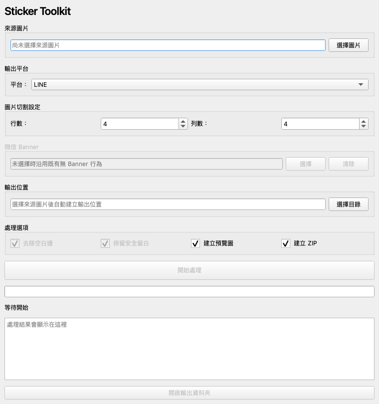

# Sticker Toolkit

Sticker Toolkit 是一套支援 macOS 與 Windows 的桌面貼圖處理工具，可將 AI 生成的規則 4×4 貼圖組圖切成 16 張、整理 16 張 WeChat 單圖，或從單張圖片產生 LINE／WeChat 封面素材。程式提供純色背景透明化、等比例縮放、安全留白、平台素材製作、Preview 與 ZIP 打包。

目前版本為 **v1.3.5**。GitHub Releases 的最新正式安裝檔目前為 v1.3.5。

## Quick Start

一般使用者不需要安裝 Python、pip 或 virtual environment，請直接從 [GitHub Releases](https://github.com/saunter-lin/StickerToolkit/releases) 下載正式版本。

| 平台 | 支援架構 | 下載格式 |
| --- | --- | --- |
| macOS | Apple Silicon（arm64） | `StickerToolkit-v1.3.5-macOS-arm64.dmg` |
| Windows 10／11 | x64 | `StickerToolkit-v1.3.5-Windows-x64.zip` |

### macOS

1. 開啟 DMG。
2. 將 `Sticker Toolkit.app` 拖曳至 `Applications`。
3. 從「應用程式」啟動。

App 目前未使用 Apple Developer 簽章或公證。若 Gatekeeper 阻擋，請在 Finder 對 App 按右鍵選擇「打開」，再確認開啟；也可前往「系統設定 → 隱私權與安全性」允許。

### Windows

1. 完整解壓縮 Windows x64 ZIP。
2. 保留資料夾內所有檔案與 `_internal` 結構。
3. 執行 `StickerToolkit.exe`。

請勿直接從 ZIP 內執行，也不要只複製 `StickerToolkit.exe`。

Windows 版本目前未使用 Microsoft Code Signing Certificate，第一次執行可能出現 Microsoft Defender SmartScreen。這是 Windows 對未簽章程式的正常保護機制，不代表程式含有病毒。請只從本專案的 GitHub Release 下載，並可使用 Release 中的 `SHA256SUMS.txt` 驗證檔案。

若出現 `Windows protected your PC`：

1. 按下 `More info`（更多資訊）。
2. 按下 `Run anyway`（仍要執行）。



## Features

- 支援 PNG、JPG、JPEG 的規則 4×4 貼圖組圖
- 支援 WeChat 16 張 PNG／JPG／JPEG 單圖 Batch
- 依 GUI 顯示順序處理及輸出貼圖
- 裁除透明或近白空白，保留安全留白並等比例置中
- 可選擇將外部連通的平坦純色背景轉為透明
- LINE：貼圖、`main.png`、`tab.png`、Preview 與 ZIP
- WeChat：貼圖、Banner、`cover.png`、`panel_icon.png`、Preview 與 ZIP
- 4×4 模式可選擇 LINE、WeChat 或同時輸出
- LINE 動圖 preset 可將 4×4 組圖準備成 16 張 270×270 透明 PNG frames，供後續動圖工具使用；本工具不編碼 APNG
- 獨立 Main / Cover 模式可由單張 PNG／JPEG 一次產生 `main.png`、`tab.png`、`cover.png` 與 `panel_icon.png`
- LINE main 與 WeChat cover 可自動產生或選擇自訂圖片
- 使用透明 RGBA PNG，並檢查尺寸、格式及平台檔案大小限制
- 三語錯誤訊息、實際處理進度、結果摘要及開啟輸出資料夾
- Desktop GUI 支援繁體中文、简体中文與 English

首次啟動時，Desktop GUI 會依系統語言選擇繁體中文、简体中文或 English。使用者可在主視窗右上角即時切換，程式會記住選擇；介面語言不會改變圖片處理方式、輸出內容、檔名或資料夾結構。

## Usage

主視窗提供四個入口：4×4 貼圖組圖、WeChat 16 張單圖 Batch、LINE 動圖與 Main / Cover。

### 4×4 Sticker Sheet

適合一張包含 4×4、共 16 格的規則貼圖組圖。

1. 選擇來源 PNG、JPG 或 JPEG。
2. 選擇 LINE、WeChat 或 LINE＋WeChat。
3. 視需要選擇 WeChat Banner、封面來源及背景透明化；4×4 WeChat 未指定 Banner 時會自動產生。
4. 開始處理並檢查 Preview。

程式只切割一次，再由 LINE 與 WeChat 共用處理後的貼圖圖片。來源檔不會被修改。

### WeChat 16-image Batch

適合已經分開產生的 16 張 WeChat 貼圖，不會再執行 4×4 切割。

- 可一次選擇超過 16 張，再使用「上移／下移／移除」整理順序。
- 「移除」只會從目前工作清單移除，不會刪除磁碟上的原始圖片。
- 實際輸出順序與 GUI 清單順序一致。
- 正式開始處理前必須整理為正好 16 張。
- Batch 模式必須另外選擇 WeChat Banner。

### LINE Animated

使用規則 4×4 組圖產生 16 張 270×270 RGBA PNG frames、Preview 與 ZIP；不會產生 `main.png`、`tab.png` 或 APNG。

### Main / Cover

選擇一張 PNG、JPG 或 JPEG，即可同時產生 LINE 與 WeChat 的四個封面類素材。`tab.png` 由最終 `main.png` 衍生，`panel_icon.png` 由最終 `cover.png` 衍生；此模式不執行 4×4 切割，也不會輸出 16 張貼圖。

### Background Removal

Sticker Toolkit 提供兩種背景整理：

- 自動裁除透明或近白空白。
- 可選的「外部連通純色背景轉透明」：只從畫布邊界移除與外部連通的指定背景色，盡量保留角色內部的白色毛髮、文字、高光與描邊。

純色背景功能不是 AI 去背，最適合單一平坦背景；複雜背景、漸層、陰影或紋理不保證效果。若原圖已是真正透明 PNG，通常不需要啟用。

AI 生圖建議：

- 推薦使用淺米黃色 `#FFF8EC`，但也可自動偵測其他平坦純色。
- 背景避免漸層、陰影、紋理或複雜內容。
- 建議在角色及文字周圍加入白色描邊。
- PNG 容差建議 `3–5`。
- JPEG 可能因壓縮產生色差，容差建議 `10–15`，可從 `12` 開始。
- 若仍有背景殘留，可逐步提高容差；數值越高，越可能影響淺色細節。

AI 生圖 Prompt 範例：

```text
Use a solid light cream background (#FFF8EC), with no gradients, shadows, or textures. The background is intended for automatic removal. Add a white outline around each sticker and clearly separate all stickers in a 4×4 grid.
```

## Output

GUI 顯示或自動建議的是「輸出根目錄」。實際產物統一放在根目錄下的 `output/`：

```text
<root>/output/
├── line_sticker/
├── line_animated/
├── wechat_sticker/
├── preview/
│   ├── line/
│   └── wechat/
├── line_sticker.zip
└── wechat_sticker.zip
```

- 4×4 模式會建議來源圖片同層的 `<來源檔名>_output` 作為根目錄。例如 `berry.png` 會使用 `berry_output/`，實際產物位於 `berry_output/output/`。
- Main / Cover 使用相同的自動根目錄規則，四個檔案獨立集中於 `<root>/cover_output/`，不會放進 4×4／Batch／LINE 動圖共用的 `<root>/output/`。
- Batch 模式會以目前第一張圖片所在資料夾作為自動根目錄；圖片來自不同資料夾時仍以第一張為準。
- 使用者手動指定的根目錄具有優先權，不會因重新排序或移除 Batch 圖片而被覆蓋。
- 若選擇的資料夾本身已名為 `output`，程式會直接使用，不會建立 `output/output`。
- 「開啟輸出資料夾」會開啟實際存放產物的 `output/`。
- 重新輸出 LINE 或 WeChat 時只清理該平台的素材、ZIP 與 Preview，不影響另一平台。

> Note：WeChat Batch 目前會依 Banner 檔名將素材目錄命名為 `{banner_stem}_wechat_sticker`；ZIP 與 Preview 仍位於同一個 `<root>/output/`。

## LINE / WeChat Specifications

### LINE

| 素材 | 規格 |
| --- | --- |
| Sticker | 16 張、370×320、RGBA PNG |
| `main.png` | 240×240、RGBA PNG |
| `tab.png` | 96×74、RGBA PNG |
| Preview | `<root>/output/preview/line/preview.png` |
| ZIP | `<root>/output/line_sticker.zip` |

### WeChat

| 素材 | 規格 |
| --- | --- |
| Sticker | 240×240；目前 UI 輸出 16 張 |
| Banner | 750×400，PNG 或 JPG 來源會轉為正式素材 |
| `cover.png` | 240×240 PNG |
| `panel_icon.png` | 50×50 PNG |
| Preview | `<root>/output/preview/wechat/wechat_preview.png` |
| ZIP | `<root>/output/wechat_sticker.zip` |

WeChat 驗證接受 8～24 張貼圖，以保留未來擴充彈性；目前 4×4 與 Batch UI 都處理 16 張。每張貼圖、Banner 與 cover 不超過 500KB，panel icon 不超過 100KB。一般 4×4 WeChat 流程若未指定 Banner，會由最終 Cover 自動產生；Batch 模式則必須先選擇 Banner。

WeChat ZIP 不包含 `manifest.json` 或其他 JSON。

## Known Limitations

- 4×4 模式預期規則排列且格子等寬的 4×4 組圖。
- WeChat Batch 正式處理前必須正好 16 張，且需要 Banner。
- 純色背景透明化不是 AI 去背，複雜背景不保證結果。
- JPEG 壓縮色差可能需要較高容差，建議優先使用 PNG。
- `tab.png` 不使用角色臉部辨識模型，只會裁切並等比例縮放完整主體。
- macOS 與 Windows 發布包目前均未使用商業 code signing。
- macOS 正式包目前僅提供 Apple Silicon arm64；Windows 正式包目前僅提供 x64。

## Development

以下內容僅供開發者、Contributor 及需要修改原始碼的使用者。一般使用者請使用 GitHub Release。

需要 Python 3.10 或更新版本：

```bash
python3 -m venv .venv
.venv/bin/python -m pip install -e '.[desktop,dev]'
```

啟動桌面版：

```bash
PYTHONPATH=src .venv/bin/python -m sticker_toolkit.ui.desktop
```

啟動 CLI：

```bash
PYTHONPATH=src .venv/bin/python -m sticker_toolkit.ui.cli --input input/example.png --platform line
```

品質檢查：

```bash
.venv/bin/python -m pytest
.venv/bin/ruff check .
.venv/bin/mypy .
.venv/bin/python -m compileall -q src core exporters tests packaging
git diff --check
```

Log 位置：

- macOS：`~/Library/Logs/StickerToolkit/sticker_toolkit.log`
- Windows：`%LOCALAPPDATA%/StickerToolkit/Logs/sticker_toolkit.log`

## Build

安裝封裝相依套件：

```bash
.venv/bin/python -m pip install -e '.[desktop,build]'
```

macOS：

```bash
PYTHON_BIN=.venv/bin/python packaging/build_macos.sh
packaging/verify_macos_app.sh
PYTHON_BIN=.venv/bin/python packaging/create_dmg.sh
```

Windows：

```powershell
powershell -ExecutionPolicy Bypass -File .\scripts\build_windows.ps1 -Python "C:\path\to\python.exe"
```

詳細資料請參閱 [Packaging 說明](packaging/README.md)、[Windows 建置說明](docs/WINDOWS_BUILD.md) 與 [Windows 原生驗證清單](packaging/WINDOWS_TEST_CHECKLIST.md)。

## Version / CHANGELOG / Roadmap

- 目前版本：`v1.3.5`
- 版本演進：[CHANGELOG.md](CHANGELOG.md)
- 正式下載：[GitHub Releases](https://github.com/saunter-lin/StickerToolkit/releases)

Roadmap：

- 支援其他列數與欄數的組圖
- Developer ID 簽章、公證及 Windows code signing
- 評估 Intel／Universal macOS 建置
- 裁切與安全留白即時調整
- 更多平台 exporter
