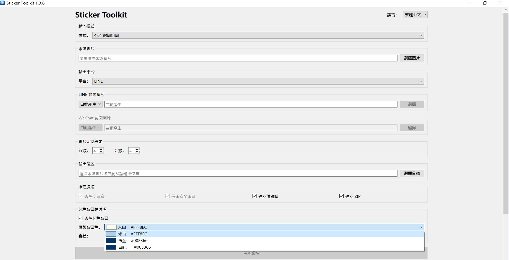

# Sticker Toolkit

Sticker Toolkit 是用於 LINE／WeChat 貼圖素材處理的 macOS 與 Windows 桌面工具，支援 4×4 組圖切割、平台素材輸出、純色背景透明化，以及 Main / Cover 製作。

目前正式版本為 **v1.3.6**。

## Download

一般使用者不需要安裝 Python、pip 或 virtual environment，請直接下載正式版本：

| 平台 | 支援架構 | 下載 |
| --- | --- | --- |
| macOS | Apple Silicon（arm64） | [StickerToolkit-v1.3.6-macOS-arm64.dmg](https://github.com/saunter-lin/StickerToolkit/releases/download/v1.3.6/StickerToolkit-v1.3.6-macOS-arm64.dmg) |
| Windows 10／11 | x64 | [StickerToolkit-v1.3.6-Windows-x64.zip](https://github.com/saunter-lin/StickerToolkit/releases/download/v1.3.6/StickerToolkit-v1.3.6-Windows-x64.zip) |

完整版本資訊與 SHA-256 請參閱 [GitHub Release v1.3.6](https://github.com/saunter-lin/StickerToolkit/releases/tag/v1.3.6)。

### macOS

1. 開啟 DMG。
2. 將 `Sticker Toolkit.app` 拖曳至 `Applications`。
3. 從「應用程式」啟動。

App 尚未使用 Apple Developer 簽章或公證。若 Gatekeeper 阻擋，請在 Finder 對 App 按右鍵選擇「打開」，再確認開啟；也可前往「系統設定 → 隱私權與安全性」允許。

### Windows

1. 完整解壓縮 Windows x64 ZIP。
2. 保留所有檔案與 `_internal` 資料夾。
3. 執行 `StickerToolkit.exe`。

請勿直接從 ZIP 執行，也不要只複製 `StickerToolkit.exe`。Windows 版本尚未使用 Microsoft Code Signing Certificate，第一次執行可能出現 Microsoft Defender SmartScreen；這是未簽章程式的正常保護機制，不代表程式含有病毒。

若出現 `Windows protected your PC`：

1. 按下 `More info`（更多資訊）。
2. 按下 `Run anyway`（仍要執行）。

## Main Workflows

### Sticker Processing

| 模式 | 輸入 | 主要輸出 |
| --- | --- | --- |
| 4×4 Sticker Sheet | 一張規則 4×4 PNG／JPG／JPEG | 16 張 LINE、WeChat 或雙平台貼圖素材 |
| WeChat Batch | 16 張獨立 PNG／JPG／JPEG 與一張 Banner | 依 GUI 排序輸出的 WeChat 貼圖素材 |
| LINE Animated | 一張規則 4×4 組圖 | 16 張 270×270 RGBA PNG frames、Preview 與 ZIP |

4×4 模式只切割一次，再由 LINE 與 WeChat 共用處理後的貼圖；來源檔不會被修改。可選擇平台、封面來源、WeChat Banner、純色背景透明化、Preview 與 ZIP。

WeChat Batch 可先選超過 16 張，再使用「上移／下移／移除」整理順序；移除只影響目前清單，不會刪除原始檔。正式處理前必須整理為正好 16 張，並指定 Banner。

LINE Animated 是 frame preparation workflow：不產生 `main.png`、`tab.png` 或 APNG，也不負責完整動畫編排。

### Main / Cover

Main / Cover 是獨立單圖模式。選擇一張 PNG、JPG 或 JPEG，即可一次產生：

```text
cover_output/
├── main.png
├── tab.png
├── cover.png
└── panel_icon.png
```

LINE `tab.png` 由最終 `main.png` 衍生，WeChat `panel_icon.png` 由最終 `cover.png` 衍生。此模式不執行 4×4 切割，也不會輸出 16 張貼圖。

### Background Removal

Sticker Toolkit 可選擇將「與畫布外部連通的指定純色」轉為透明，盡量保留角色內部的毛髮、文字、高光與描邊。這不是 AI segmentation，最適合單一、平坦的純色背景。

v1.3.6 提供三種 Preset Background Color：

| Preset | 色碼 | 適合情況 |
| --- | --- | --- |
| Off-white／米白 | `#FFF8EC` | 深色角色、黑色或灰色毛髮，以及與淺米白有明顯反差的素材 |
| Dark Blue／深藍 | `#003366` | 白色或淺色毛髮、淺色邊緣，以及在米白背景下容易誤傷的素材 |
| Custom／自訂 | 使用者指定 | 角色與兩個預設色太接近，或生圖時使用其他固定純色背景 |

Custom 色與目前 preset 會分開保存；切換至固定色後再回到 Custom，仍會恢復最後一次選擇。

> **核心原則：**選擇與角色、毛髮、物件和描邊有明顯色差的純色背景，可以降低去背時誤傷細節的機率；沒有任何一種背景色適合所有素材。



#### Recommended Image Preparation

- 使用單一、均勻、無漸層與紋理的背景，避免陰影延伸到背景。
- 讓角色、文字與物件邊緣清楚，必要時使用對比描邊。
- `#6F8FAF` 灰藍色可作為推薦的工作描邊色之一，有助於辨識白色／淺色毛髮邊緣、檢查殘留背景及後續修圖；完成檢查後可在 Photoshop 等工具換成 `#FFFFFF`。
- `#6F8FAF` 只是 optional workflow tip，不是 Sticker Toolkit 去背的必要條件，也不保證適合所有素材。
- PNG 容差建議 `3–5`；JPEG 因壓縮色差可使用 `10–15`，並從 `12` 開始測試。
- 若仍有背景殘留，可逐步提高容差；數值越高，也越可能影響淺色細節。

AI 生圖 Prompt 範例：

```text
Use a solid light cream background (#FFF8EC), with no gradients, shadows, or textures. The background is intended for automatic removal. Add a contrasting gray-blue working outline (#6F8FAF) around each sticker and clearly separate all stickers in a 4×4 grid. The outline can be changed to white (#FFFFFF) during final editing.
```

## Output

GUI 顯示或自動建議的是「輸出根目錄」。一般貼圖流程的實際產物集中在 `<root>/output/`，不同平台使用獨立素材與 Preview 目錄；重新處理某一平台時，不會清理另一平台的結果。

```text
<root>/output/
├── line_sticker/
├── line_animated/
├── wechat_sticker/
├── preview/
│   ├── line/
│   └── wechat/
├── line_sticker.zip
└── wechat_sticker.zip
```

- 4×4 與 Main / Cover 會依來源檔名建議 `<來源檔名>_output` 作為輸出根目錄。
- Main / Cover 素材位於 `<root>/cover_output/`，不會與貼圖輸出混合。
- WeChat Batch 以第一張圖片所在資料夾作為自動根目錄；圖片來自不同資料夾時仍以第一張為準。
- 使用者手動指定的根目錄在目前 session 中具有優先權。
- 若選擇的資料夾本身名為 `output`，程式會直接使用，不建立 `output/output`。

> Technical note：WeChat Batch 目前會依 Banner 檔名將素材目錄命名為 `{banner_stem}_wechat_sticker`；ZIP 與 Preview 仍位於同一個 `<root>/output/`。

## LINE / WeChat Specifications

### LINE

| 素材 | 規格 |
| --- | --- |
| Sticker | 16 張、370×320、RGBA PNG |
| `main.png` | 240×240、RGBA PNG |
| `tab.png` | 96×74、RGBA PNG |
| Preview | `<root>/output/preview/line/preview.png` |
| ZIP | `<root>/output/line_sticker.zip` |

### WeChat

| 素材 | 規格 |
| --- | --- |
| Sticker | 240×240；目前 UI 輸出 16 張 |
| Banner | 750×400；PNG 或 JPG 來源會轉為正式素材 |
| `cover.png` | 240×240 PNG |
| `panel_icon.png` | 50×50 PNG |
| Preview | `<root>/output/preview/wechat/wechat_preview.png` |
| ZIP | `<root>/output/wechat_sticker.zip` |

WeChat 驗證接受 8～24 張貼圖，以保留未來擴充彈性；目前 4×4 與 Batch UI 都處理 16 張。一般 4×4 WeChat 流程未指定 Banner 時會由最終 Cover 自動產生；Batch 模式則必須先選擇 Banner。WeChat ZIP 不包含 `manifest.json`。

## Languages

Desktop GUI 支援繁體中文、简体中文與 English。首次啟動依系統語言選擇，之後可在主視窗即時切換並記住選擇；介面語言不會改變圖片處理、輸出內容、檔名或資料夾結構。

## Known Limitations

- 4×4 模式預期規則排列、格子等寬的 4×4 組圖。
- WeChat Batch 正式處理前必須正好 16 張，且需要 Banner。
- Background Removal 針對平坦純色背景，不等同 AI segmentation 或專業 Photoshop 級去背；複雜背景、漸層與照片背景不保證效果。
- JPEG 壓縮色差可能需要較高容差，建議優先使用 PNG。
- LINE Animated 只輸出 animation frames／準備素材；frame-based GIF／APNG 動畫編排屬於獨立的 Sticker Motion Toolkit 工作範圍。
- `tab.png` 不使用角色臉部辨識模型，只會裁切並等比例縮放完整主體。
- macOS 與 Windows 發布包尚未使用商業 code signing。
- macOS 正式包目前提供 Apple Silicon arm64；Windows 正式包提供 x64。

## Development

以下內容僅供開發者、Contributor 及需要修改原始碼的使用者。一般使用者請下載 GitHub Release。

需要 Python 3.10 或更新版本：

```bash
python3 -m venv .venv
.venv/bin/python -m pip install -e '.[desktop,dev]'
```

啟動桌面版：

```bash
PYTHONPATH=src .venv/bin/python -m sticker_toolkit.ui.desktop
```

啟動 CLI：

```bash
PYTHONPATH=src .venv/bin/python -m sticker_toolkit.ui.cli --input input/example.png --platform line
```

Log 位置：

- macOS：`~/Library/Logs/StickerToolkit/sticker_toolkit.log`
- Windows：`%LOCALAPPDATA%/StickerToolkit/Logs/sticker_toolkit.log`

## Testing

```bash
.venv/bin/python -m pytest
.venv/bin/python -m ruff check .
.venv/bin/python -m mypy src tests
.venv/bin/python -m compileall -q src tests
git diff --check
```

## Build

安裝封裝相依套件：

```bash
.venv/bin/python -m pip install -e '.[desktop,build]'
```

macOS：

```bash
PYTHON_BIN=.venv/bin/python packaging/build_macos.sh
PYTHON_BIN=.venv/bin/python packaging/verify_macos_app.sh
PYTHON_BIN=.venv/bin/python packaging/create_dmg.sh
```

Windows：

```powershell
powershell -ExecutionPolicy Bypass -File .\scripts\build_windows.ps1 -Python "C:\path\to\python.exe"
```

詳細資料請參閱 [Packaging 說明](packaging/README.md)、[Windows 建置說明](docs/WINDOWS_BUILD.md) 與 [Windows 原生驗證清單](packaging/WINDOWS_TEST_CHECKLIST.md)。

## Version / CHANGELOG / Roadmap

- 目前版本：`v1.3.6`
- 版本演進：[CHANGELOG.md](CHANGELOG.md)
- 正式下載：[GitHub Releases](https://github.com/saunter-lin/StickerToolkit/releases)

Roadmap：

- 支援其他列數與欄數的組圖
- Developer ID 簽章、公證及 Windows code signing
- 評估 Intel／Universal macOS 建置
- 裁切與安全留白即時調整
- 更多平台 exporter
